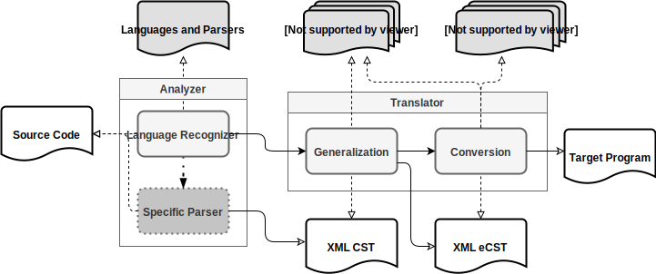

The AS2SCompiler is an acronym for _Another Source-to-Source Compiler_. 

Currently, it is possible to convert Java programs into C programs and vice-versa*. The compiler is designed to be easily extended. Then, you can add support to other Imperative (Object-Oriented and Procedural) programming languages by providing Translation Schemes for them.

AS2SCompiler is part of a research project named **"A Source-to-Source Compilation Strategy by Language-Neutral Source Code Representation"** carried out at Universidade Estadual do Norte do Paraná ([UENP](https://uenp.edu.br/)) and Universidade de São Paulo ([USP](https://www5.usp.br/)) in Brazil.

The complete description of the compilation strategy followed to build AS2SCompiler can be found (in Portuguese) [here](https://drive.google.com/open?id=13Qi5U-uxc76yWdr-WceWd4L8Yk35H4tG).

## Empirical Validation

An experimental study was carried out to validate the proposed strategy empirically. 

The experiment package is publicly available [here](https://drive.google.com/file/d/14E9PKYZtUAU346ZNdzJ860qONHcES3oO/view?usp=sharing), and the test environment of the compiler is accessible [here](https://github.com/RafaelSantosBraz/AS2SCompiler/releases/tag/v1.0-beta-test.2). Besides, all tested programs in C and Java can be found [here](https://github.com/RafaelSantosBraz/AS2SCompiler/tree/master/runtime/examples).

## Usage

To run AS2SCompiler, you need to install a JRE/JDK (it was tested mainly through [OpenJDK](https://openjdk.java.net/) 8).

After that, download the latest executable [here](https://github.com/RafaelSantosBraz/AS2SCompiler/releases) and use that command on a terminal:

```sh
$ java -jar AS2SCompiler.jar [PARAMS]
```

You have to give, in the same order, those parameters:

### Parameters

* **Input Language**: the name (lowercase) of source code language (e.g., java).
* **Output Language**: the name (lowercase) of object code language (e.g., c).
* **Input Directory**: the path to the folder containing the source code.
* **Output Directory**: the path to the folder where object code will be placed.
* **Translation Scheme**: the path to the Translation Scheme** of the indicated input language.

## Translation Process

Read the strategy documentation to understand all the phases and processes.

In short, two mechanisms are working together: Analyzer and Translator.

The **Analyzer** mechanism aims to analyze the Source Code and by executing a **Specific Parser** (a syntax analyzer, e.g., a Java parser) and exporting an equivalent CST (Concrete Syntax Tree) in XML.

The **Translator** mechanism aims to translate the generated CST into the Target Program. Two main processes have to be executed: Generalization and Conversion.

The **Generalization** process receives a CST in XML and a Translation Scheme (a set of mapping rules from CST elements to equivalent eCST elements) to build a language-neutral intermediate representation (IR). In this case, the adopted IR is an eCST (enriched Concrete Syntax Tree) that can represent code written in multiple languages (e.g., Java, C, C#, Python, and more).

The **Conversion** process receives the generated eCST in XML and writes an equivalent version in a real high-level programming language (indicated by the user). The Languages' Specific Features (a set of translation rules from an eCST to code) has to be provided.

The described strategy diagram:



## Translation Example

As a simple example, see the Java code below. There is a method named _find_ that does a Binary Search on an int array and returns the index of the _searchkey_ in the array.

```java
// file Name: OrdArray.java
public class OrdArray {

    public int find(int searchKey, int[] a, int nElems) {
        int lowerBound = 0;
        int upperBound = nElems - 1;
        int curIn;
        while (true) {
            curIn = (lowerBound + upperBound) / 2;
            if (a[curIn] == searchKey) {
                return curIn;
            } else {
                if (lowerBound > upperBound) {
                    return nElems;
                } else {
                    if (a[curIn] < searchKey) {
                        lowerBound = curIn + 1;
                    } else {
                        upperBound = curIn - 1;
                    }
                }
            }
        }
    }

}
```

After running the AS2SCompiler to translate the OrdArray.java file into an equivalent C program, the C code bellow would be generated.

```c
// file Name: OrdArray.c
#include <stdlib.h>
#include <stdio.h>

struct OrdArray
{
    int (*find)(
        int searchKey,
        int a[],
        int nElems,
        struct OrdArray *_this);
};

int find(int, int[], int, struct OrdArray *);

struct OrdArray *OrdArray()
{
    struct OrdArray *_this = malloc(sizeof(struct OrdArray));
    _this->find = find;
    return _this;
}

int find(int searchKey, int a[], int nElems, struct OrdArray *_this)
{
    int lowerBound = 0;
    int upperBound = (nElems - 1);
    int curIn;
    while (1)
    {
        curIn = ((lowerBound + upperBound) / 2);
        if ((a[curIn] == searchKey))
        {
            return curIn;
        }
        else
        {
            if ((lowerBound > upperBound))
            {
                return nElems;
            }
            else
            {
                if ((a[curIn] < searchKey))
                {
                    lowerBound = (curIn + 1);
                }
                else
                {
                    upperBound = (curIn - 1);
                }
            }
        }
    }
}
```

##### notes

*Disclaimer: It is not possible to translate the entire language so far, AS2SCompiler currently covers only a limited set of aspects.

**Translation Schemes for Java and C can be found in the runtime/Tmaps folder that is downloaded with the AS2SCompiler release.
